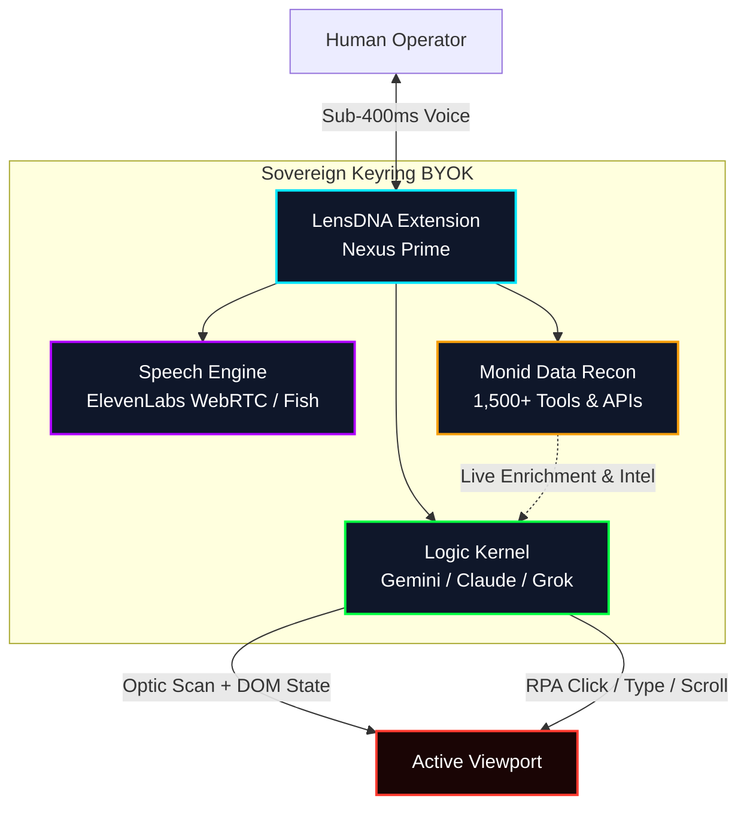
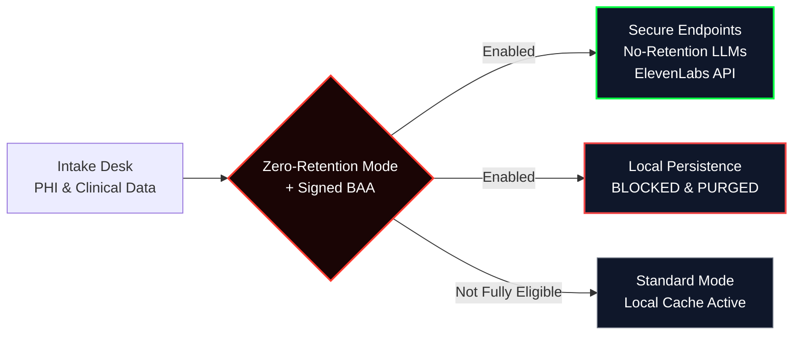

# LensDNA Sovereign Agent

**Open-Source Robotic Infrastructure for Vertical AI Co-Pilots.**  
*Bridging the gap between frontier models and closed execution environments. LensDNA injects Eyes (Computer Vision & DOM extraction), Hands (Deterministic RPA), Voice (Sub-400ms Latency Audio Streams), and Multi-API Data Recon directly into the active browser viewport.*

---

## ⚡ The Execution Gap (Solved)

Most AI agents stop at the open web, fenced in by static APIs and proxy gateways. They fail the moment they are confronted with localized legacy infrastructure: 15-year-old insurance claims portals, localized ERP databases, VPN-gated CRMs, or any closed system that demands fluid, human-like interaction.

**LensDNA is the physical interface.**  
As a native Chrome, Brave, and Edge extension, LensDNA runs on the client-side of the host machine. By rendering directly into the active browser viewport, it bypasses security layers that block cloud proxies, analyzing visual layout states, executing human-simulated RPA actions (deterministic typing, clicking, and focusing), and orchestrating multi-channel workflows with full local-context preservation.

---

## 🧠 System Architecture & Topology

The LensDNA engine uses a sovereign client-side keyring mapping three primary processing pipelines: the conversational voice stream, browser DOM automation logic, and advanced live intelligence retrieval via Monid integration.



### Core Capabilities

* **Active-Tab Optic Scanner** — Parallel computer vision frame analysis matched with live DOM structure extraction and mutation sequencing tracking.
* **Autonomous Hand-Simulating RPA** — Deterministic automation interface using `execCommand` fallbacks for pasting into strict rich-text editors (LinkedIn, X, enterprise ERPs) with focus-memory tracking.
* **Sub-400ms WebRTC Voice Flow** — Native audio pipeline using ElevenLabs conversational agents + client-side `AudioWorkletNode` for high-frequency PCM16 processing.
* **Persistent Memory Layer** — Long-term facts are recorded, compiled, and force-injected back into the runtime context on every session start.
* **Unified Data Recon (via Monid)** — On-demand access to 1,500+ scrapers and APIs for lead enrichment, social intel, market data, competitor tracking, and more.

---

## 🛡️ Enterprise-Grade HIPAA Gateway Protocol

When deployed in clinical environments, medical workflows demand strict data processing guidelines. The LensDNA console includes a dedicated **HIPAA and Zero-Retention Mode (ZRM)** gateway to keep protected health information (PHI) secure.



### Compliance Implementation

* **Zero Local Cache Footprint** — Once ZRM is toggled with an active Business Associate Agreement (BAA), LensDNA blocks all writes of conversational data, clinical summaries, or page extractions to local extension storage / Chrome storage.
* **Custom LLM Provider Safety Gating** — If a non-preconfigured LLM is selected while ZRM is active, the client requires explicit acknowledgment that the custom endpoint is covered under a valid BAA.
* **Preconfigured Eligible Directory** — Direct compatibility with verified HIPAA-eligible models (Gemini 2.5 Flash family, Claude Sonnet / Opus / Haiku 4.x series, and ElevenLabs voice endpoints).

---

## 🎛️ Multimodal Console Modules

Beyond standard browser automation, LensDNA includes production-ready media modules:

### 1. Outbound SIP Proxy Dialer
Bridged to standard telephony networks via Twilio proxies.
* **Live Agent Dispatching** — Routes the logic model (Grok / Gemini) to any E.164 telephone number.
* **Direct Audio Injection** — Streams generated audio compositions into live phone calls (alerts, compliance messages, remote delivery).

### 2. 8-Channel Studio Matrix Mixer
Client-side synthesizer deck powered by a cross-tab `BroadcastChannel` bridge.
* **Synchronized Stem Generation** — Up to 8 parallel audio stems (vocals, instruments, SFX).
* **Interactive Fader Board** — Vertical equalizers for volume, pan, LO / MID / HI EQ, and weight focus.
* **Vocal Alignment** — Timing alignment that maps and scrolls lyric content in sync with playback.

---

## 🛠️ Local Installation

As a sovereign tool designed for complete client-side data governance, LensDNA runs entirely in your local browser runtime.

### Step 1 — Clone the Repository
```bash
git clone https://github.com/kaascanvas/LensDNA-Extension.git
# or download and extract the source ZIP
```

### Step 2 — Enable Developer Mode in Google Chrome
1. Navigate to `chrome://extensions/`
2. Turn **ON** the **Developer mode** toggle (top-right).
3. Click **Load unpacked**.
4. Select the folder that contains `manifest.json`.

### Step 3 — Keyring Configuration & Initialization
1. Pin the **LensDNA Sovereign Agent** extension.
2. Open the Side Panel console.
3. Enter your keys in the **Sovereign Keyring**:
   * **ElevenLabs API Key** — WebRTC conversational loop
   * **Gemini / Grok / Claude Key** — Logic + vision
   * **Monid API Key** — Data recon & scraper pipelines
   * **Fish Audio Key** *(optional)*
4. Click **INITIATE UPLINK**.

---

## 📦 Changelog

### v1.0.2 — Monid & Data Recon Integration
* Full Monid.ai keyring integration.
* Agent can discover, call, and poll from 1,500+ modular data tools.
* Live extraction results feed directly back into the Logic Kernel for immediate viewport actions.

### v1.0.1 — Client-Side Memory Re-hydration
* Persistent memory facts are force-injected into the runtime context on every session start.
* Improved WebRTC audio stability under heavy DOM manipulation.

---

## ⚖️ Custom Deployment & Enterprise Integrations

Need a white-labeled Electron desktop app, custom backend bridges, industry-specific tool packs, or full Zero-Retention hardening?

We build **Custom Automation Cartridges**.

* 📧 **Architect**: [hans@lensdj.app](mailto:hans@lensdj.app)
* 🐦 **X**: [@LensDJing](https://x.com/LensDJing)
* 🌐 **Website**: [lensdj.app](https://lensdj.app)
* 🔑 **Monid**: [monid.ai](https://monid.ai)

---

*Built for secure, high-value visual workflows inside the legacy environments that general cloud assistants cannot reach.*

**License**: MIT | **Development**: Active Maintenance | **System Design**: Sovereign BYOK
