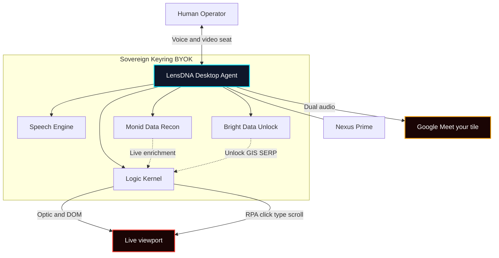
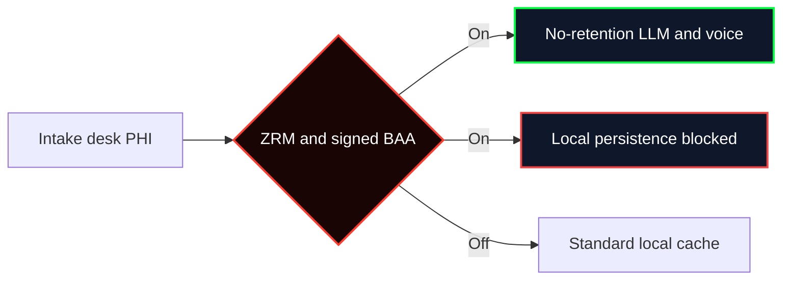

# LensDNA — Desktop Agent

**Open-source robotic infrastructure for vertical AI co-pilots.**  
Nexus Prime is a **desktop agent** that sits on the operator’s machine: eyes on the live viewport, hands on the page, voice on the same seat as the human.

This repository is the Chromium sidecar for that agent (Chrome / Brave / Edge, loaded unpacked). It is **not** a Chrome Web Store product and is not distributed as a public “browser extension.” Store review treats this capability set as hostile. We treat it as an endpoint agent the operator installed on purpose.

> Repo path stays `LensDNA-Extension` because Chromium is the current runtime. The product is the agent.

---

## Why “desktop agent”

Cloud agents stop at public APIs. They cannot type into a VPN-gated CRM, read a 15-year-old claims portal, sit in *your* Google Meet tile, or keep keys on the desk.

LensDNA runs next to the operator:

* **Eyes** — optic scan + DOM extract of the active tab  
* **Hands** — deterministic RPA (type / click / scroll) with React / Vue / Draft.js setters  
* **Voice** — ElevenLabs WebRTC, sub-400ms, plus on-demand Meet dual audio  
* **Recon** — Monid (1,500+ tools) + Bright Data unlock / GIS / SERP  

Same seat as the human. Not a second meeting bot. Not a cloud browser farm.


```mermaid
graph TD
    A[Human Operator] <-->|Voice and video seat| B[LensDNA Desktop Agent]
    B --- N[Nexus Prime]

    subgraph KEYRING [Sovereign Keyring BYOK]
        B --> C[Logic Kernel]
        B --> D[Speech Engine]
        B --> E[Monid Data Recon]
        B --> G[Bright Data Unlock]
    end

    C -->|Optic and DOM| F[Live viewport]
    C -->|RPA click type scroll| F
    B -->|Dual audio| H[Google Meet your tile]
    E -.->|Live enrichment| C
    G -.->|Unlock GIS SERP| C

    style B fill:#0f172a,stroke:#00e5ff,stroke-width:2px,color:#fff
    style H fill:#1a0505,stroke:#f59e0b,stroke-width:2px,color:#fff
    style F fill:#1a0505,stroke:#ff3b30,stroke-width:2px,color:#fff
```

---

## What it is / is not

| It is | It is not |
|---|---|
| A local desktop agent for the operator who loaded it | A Chrome Web Store extension |
| BYOK — keys stay in the sidecar | A multi-tenant SaaS proxy that holds your keys |
| One Meet seat: your camera, Nexus on your mic | A second named participant / meeting bot |
| Unpacked load on a machine you control | Remote-control malware, a RAT, or a silent implant |

If you did not load it, it does nothing. If you mute Meet, Nexus is muted too.

---

## Core capabilities

* **Active-tab optic scanner** — Vision frame + live DOM. SNAP lands in the same voice turn via `sendContextualUpdate`.
* **Hand-simulating RPA** — Native value setters + `execCommand` / paste fallbacks. Focus memory so the side panel does not steal the target field.
* **WebRTC voice** — ElevenLabs conversational agent + `AudioWorklet` PCM16 / µ-law.
* **Meet dual audio (v1.2)** — One 🎧 toggle, default **off**. Out: Nexus TTS mixed into your Meet microphone. In: Meet playback tapped into Nexus so headphones do not deafen the agent. No VB-Cable. Chrome Meet tab only. Details: [`MEET_INJECT.md`](./MEET_INJECT.md).
* **Bright Data industrial unlock** — Web Unlocker, GIS / parcel, SERP, protected portals.
* **Monid recon** — On-demand scrapers and APIs for leads, social, market, competitor intel.
* **Persistent memory** — `[MEMORY_SAVE: …]` compiled and rehydrated on every uplink.
* **Field Operator** — Meter-true device GPS fused with optic + GIS so vision budget goes to *what*, not *where*.
* **Outbound SIP dialer** — Twilio proxy, live agent dispatch or audio injection to an E.164 number.
* **8-channel studio matrix** — Client-side stems, faders, lyric alignment.

---

## Meet seat — 🎧 dual audio

Boardy (or anyone else in the room) hears Nexus **as you**. Meet still shows one tile.

1. Open Meet in this Chrome profile. Headphones on.  
2. Side panel → **INITIATE UPLINK**.  
3. Click **🎧**. Amber = armed.  
4. Stay **unmuted** in Meet. Mute kills both voices.  
5. Sit on camera. Stay quiet. Nexus talks and hears the room.

If uplink was already live and Nexus ignores the room: **DISCONNECT**, leave 🎧 armed, **INITIATE UPLINK** again. ElevenLabs takes the mic once at session start.

Zoom desktop and Meet mobile are out of scope. Speakers + 🎧 = echo.

---

## Runtime and distribution

Current runtime: unpacked Chromium sidecar (`manifest.json` at the repo root).

**Not submitted to the Chrome Web Store.** Broad host access + RPA + tab audio + mic mix is a desktop-agent permission model. Store review scores that surface as unwanted software. We do not ask Google to bless it as a toy extension.

Roadmap for the host is a signed desktop shell (Tauri / native) that owns the process and treats Chromium as the viewport — same agent, clearer category. This repo remains the open sidecar.

---

## HIPAA / Zero-Retention gateway

Clinical desks need a hard gate, not a promise.


```mermaid
flowchart LR
    A[Intake desk PHI] --> B{ZRM and signed BAA}

    B -->|On| C[No-retention LLM and voice]
    B -->|On| D[Local persistence blocked]
    B -->|Off| E[Standard local cache]

    style B fill:#1a0505,stroke:#ff3b30,stroke-width:2px,color:#fff
    style C fill:#0f172a,stroke:#00ff41,stroke-width:2px,color:#fff
    style D fill:#0f172a,stroke:#ef4444,stroke-width:2px,color:#fff
```

* ZRM + Enterprise + signed BAA → no writes of transcripts, clinical summaries, or page extracts to `chrome.storage` / local cache.  
* Custom LLM while ZRM is on requires an explicit BAA acknowledgment.  
* Preconfigured eligible directory includes Gemini 2.5 Flash family, Claude Sonnet / Opus / Haiku 4.x, and ElevenLabs voice endpoints.

---

## Local install

Sovereign load. You pick the folder. Nothing is pushed from a store.

```bash
git clone https://github.com/kaascanvas/LensDNA-Extension.git
```

1. Chrome / Brave / Edge → `chrome://extensions/`  
2. **Developer mode** ON  
3. **Load unpacked** → select the folder that contains `manifest.json`  
4. Pin **LensDNA Sovereign Agent**  
5. Open the side panel. Fill the **Sovereign Keyring** (BYOK):

   | Key | Role |
   |---|---|
   | ElevenLabs | Voice loop |
   | Gemini / Grok / Claude | Logic + vision |
   | Bright Data | Unlock / GIS / SERP |
   | Monid | Recon pipelines |
   | Fish Audio | Optional TTS |

6. **INITIATE UPLINK**

See [`INSTALL_INSTRUCTIONS.txt`](./INSTALL_INSTRUCTIONS.txt) and [`MEET_INJECT.md`](./MEET_INJECT.md).

---

## Changelog

### v1.2.0 — Desktop-agent seat + Meet dual audio
* Category language: desktop agent, local sidecar, not a store extension.  
* 🎧 on-demand dual audio on Google Meet (speak on your mic track, hear Meet playback).  
* MAIN-world `getUserMedia` / `RTCPeerConnection` mix (`inject-meet-mix.js`).  
* `tabCapture` ear + Meet media `captureStream` fallback.  
* Default off. Headphones required.

### v1.1.0 — Client tools, optic loop & Bright Data surface
* Tool aliases aligned with the agent (`type_text_in_active_page`, `click_element_in_active_page`, `read_active_tab_data`, `report_field_position`, `forge_dossier`).  
* postMessage bridge so overlays share the same DOM hands.  
* SNAP → `sendContextualUpdate`.  
* Field Operator GPS as a callable tool.

### v1.0.2 — Monid recon
* Keyring + discover / run / poll across 1,500+ modular tools.

### v1.0.1 — Memory rehydration
* Persistent facts force-injected on every session start.

---

## Custom cartridges

White-label desktop host, industry tool packs, Zero-Retention hardening, or a signed shell instead of the sidecar.

* Architect: [hans@lensdj.app](mailto:hans@lensdj.app)  
* X: [@LensDJing](https://x.com/LensDJing)  
* Site: [lensdj.app](https://lensdj.app)  
* Monid: [monid.ai](https://monid.ai)  
* Bright Data: [brightdata.com](https://brightdata.com)

---

**License:** MIT  
**Distribution:** local unpacked sidecar — not Chrome Web Store  
**System design:** sovereign BYOK desktop agent
